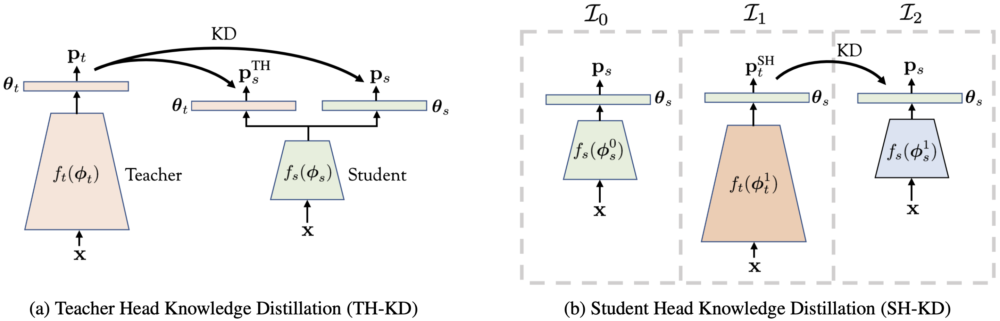

# It's All in the Head: Representation Knowledge Distillation through Classifier Sharing
<br> [Paper](https://arxiv.org/...)


> Emanuel Ben-Baruch, Matan Karklinsky, Yossi Biton, Avi Ben-Cohen, Hussam Lawen, Nadav Zamir<br/> DAMO Academy, Alibaba
> Group

**Abstract**
Representation knowledge distillation aims at transferring rich information from one model to another.
Current approaches for representation distillation mainly focus on the direct minimization of distance metrics between the models' embedding vectors.
Such direct methods may be limited in transferring high-order dependencies embedded in the representation vectors, or in handling the capacity gap between the teacher and student models. 
In this paper, we introduce two  approaches for enhancing representation distillation using classifier sharing between the teacher and student. 
Specifically, we first show that connecting the teacher's classifier to the student backbone and freezing its parameters is beneficial for the process of representation distillation, yielding consistent improvements. 
Then, we propose an alternative approach that asks to tailor the teacher model to a student with limited capacity. This approach competes with and in some cases surpasses the first method.
Via extensive experiments and analysis, we show the effectiveness of the proposed methods on various datasets and tasks, including image classification, fine-grained classification, and face verification. 
For example, we achieve state-of-the-art performance for face verification on the IJB-C dataset for a MobileFaceNet model: TAR@(FAR=1e-5)=93.7\%. Code will be made available.

&nbsp;

<p align="center">
 <table class="tg">
  <tr>
    <td class="tg-c3ow"></td>
  </tr>
</table>
</p> 

&nbsp;

# Training
We provide the training code for CIFAR-100, extending the RepDistiller repo [CRD] ([link](https://github.com/HobbitLong/RepDistiller)). 

### Training with TH-KD
An example of using the TH-KD scheme with regular KD loss: 
```
python train_student.py --path_t /saved_models/resnet32x4_vanilla/ckpt_epoch_240.pth --distill kdth --model_s resnet8x4 -r 1 -a 1.5 -b 0.02 --trial 1
```

An example of using the TH-KD scheme with the CRD loss:
```
python train_student.py --path_t /saved_models/resnet32x4_vanilla/ckpt_epoch_240.pth --distill crdth --model_s resnet8x4 -r 0.9 -a 1 -b 0.8 -d 0.02 --trial 1
```
The teacher model can be downloaded [here](https://miil-public-eu.oss-eu-central-1.aliyuncs.com/model-zoo/HeadSharingKD/ckpt_epoch_240.pth).

&nbsp;

### Training with SH-KD
First, train the teacher with the student's classifier:
```
python train_teacher.py --model resnet32x4 --path_th /saved_models/resnet8x4_student.pth
```
A student model can be downloaded from [here](https://miil-public-eu.oss-eu-central-1.aliyuncs.com/model-zoo/HeadSharingKD/resnet8x4_student.pth).

Next, train the student using the obtained teacher:
```
python train_student.py --path_t /saved_models/resnet32x4_SHKD.pth --distill crd --model_s resnet8x4 -r 1 -a 1.0 -b 0.8 --trial 1
```
You can find a teacher trained using the SH-KD approach [here](https://miil-public-eu.oss-eu-central-1.aliyuncs.com/model-zoo/HeadSharingKD/resnet32x4_SHKD.pth).

&nbsp;


## Acknowledgement
We thank the authors of the RepDistiller repo ([link](https://github.com/HobbitLong/RepDistiller)). This code is based on their great work.
